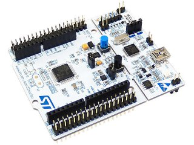

## Лабораторная работа 2.3. RTOS на примере Mbed OS
### Цель работы
Познакомиться с RTOS используя в качестве примерера Mbed OS

### 2.3.1 Введение
API-интерфейсы RTOS обрабатывают создание и уничтожение потоков в Mbed Os, а также механизмы для безопасного межпоточного взаимодействия. Потоки являются основным компонентом Mbed OS (даже main функция запускается в отдельном потоке), поэтому понимание того, как с ними работать, является важной частью разработки приложений для Mbed OS.

ConditionVariable : класс ConditionVariable предоставляет механизм для безопасного ожидания или сигнализации об изменении одного состояния. Нельзя вызывать функции ConditionVariable из контекста ISR.

EventFlags : канал событий, который предоставляет общий способ уведомления других потоков об условиях или событиях. Можно вызывать некоторые функции EventFlags из контекста ISR, и каждый объект EventFlags может поддерживать до 31 флага.

IdleLoop : фоновый системный поток, выполняется, когда другие потоки не готовы к запуску.

Kernel interface functions : пространство имен ядра реализует функции для управления или чтения информации RTOS, например, как количество тактов.

Mail : API, который предоставляет очередь в сочетании с пулом памяти для распределения сообщений.

Mutex : класс, используемый для синхронизации выполнения потоков.

Queue : класс, позволяющий ставить указатели на данные из потоков-производителей в потоки-потребители.

Semaphore : класс, который управляет доступом потоков к пулу общих ресурсов определенного типа.

ThisThread : класс, с помощью которого вы можете управлять текущим потоком.

Thread : класс, который позволяет определять, создавать и контролировать параллельные задачи.

[Документация](https://os.mbed.com/handbook/RTOS#implementation)
### 2.3.2 Таймеры
В Mbed есть простой таймер для вызова функции с определенной периодичностью. Он называется Ticker.

Пример программы:
Timer.cpp:
```C++
    #include "mbed.h"
	
	Ticker toggle_led_ticker; //Создаётся объект класса Ticker 
	DigitalOut led1(LED1);
	void toggle_led() //Переключение лампочки
	{
		led1 = !led1;
	}

	int main()
	{
		//Срабатывание переключения лампочки каждые 100 миллисекунд
		toggle_led_ticker.attach(&toggle_led, 0.1);
		while (true) {
			//Какие либо другие действия
		}
	}
```
Нужно создать объект класса Ticker, и привязать (attach) срабатывание функции toggle_led каждые 100 миллисекунд. Синтаксис очень похож на JavaScript и иные языки, в которых есть абстракция таймера. 
После компиляции можно увидеть быстро (10 раз в секунду) мигающий светодиод.

### 2.3.3 Потоки
Необходимо модифицировать программу так, чтобы она мигала светодиодом в отдельном потоке. Тогда вызов будет неблокирующий, и программа сможет делать что-то ещё помимо мигания светодиодом.
Пример программы с двумя потоками. Здесь создается объект класса "Поток" (Thread). Получается, что в программе участвуют два потока: один (основной поток программы) мигает светодиодом, а другой (новый) печатает символы.

Пример программы:
thread.cpp:
```C++
    #include "mbed.h"
	void print_char(char c = '*') //Функция вывода символа
	{
		printf("%c", c);
		fflush(stdout);
	}

	Thread thread; //Создаётся объект класса Thread

	DigitalOut led1(LED1);

	void print_thread() //Функция отдельного потока, в которой выводится символ
	{
		while (true) {
			wait(1);
			print_char();
		}
	}

	int main()
	{
		printf("\n\n*** RTOS basic example ***\n");
		thread.start(print_thread); //Включение отдельного потока с выводом символа
		while (true) { //Отдельный поток с переключением лампочки
			led1 = !led1;
			wait(0.5);
		}
	}
```
### 2.3.4 Кнопка + Прерывание
Следующий пример кода. При удерживании кнопки User Button (это синяя кнопка на Nucleo) мигание будет происходить быстрее.

Пример программы:
interrupt.cpp:
```C++
	#include "mbed.h"

	InterruptIn button(USER_BUTTON); //Создание объекта класса прерывания
	DigitalOut led(LED1);

	double delay = 0.5; // 500 ms
	void pressed() //Функция, если нажата кнопка
	{
		delay = 0.1; // 100 ms
	}

	void released() //Если отжата кнопка
	{
		delay = 0.5; // 500 ms
	}

	int main()
	{
	// Assign functions to button
		button.fall(&pressed); //Кнопка нажата
		button.rise(&released); // Кнопка отжата
		while (1) {
			led = !led;
			wait(delay); //Ожидание в зависимости от того, нажата кнопка или нет
		}
	}
```
### 2.3.5 Устраняем дребезг контактов
Можно заметить, что когда кнопка нажата - иногда происходят ложные срабатывания. Например, нажата кнопка однократно, а программа выдает, что было несколько нажатий кнопки. Это известная проблема, называемая “дребезг контактов”. Ее причина в том, что механические контакты кнопки за счет упругости материала колеблются еще некоторое время после того, как уже отпущена кнопку, и поэтому регистрируются ложные нажатия. Бороться с этой проблемой можно на физическом уровне (разные кнопки выдают разный дребезг, зависит от их качества исполнения), но чаще всего ее решают программным образом.

Пример программы:
bounce.cpp:
```C++
	#include "mbed.h"

	DigitalOut led1(LED1);

	InterruptIn button1(USER_BUTTON); //Создаётся объект класса прерывания
	volatile bool button1_pressed = false; // Используется в главном цикле
	volatile bool button1_enabled = true; // Используется для устранения дребезга
	Timeout button1_timeout; // Used for debouncing

	// Включение кнопки, когда дребезг кончится
	void button1_enabled_cb(void)
	{
		button1_enabled = true;
	}

	// Событие при нажатии кнопки
	void button1_onpressed_cb(void)
	{
		if (button1_enabled) { // Выключение кнопки, когда на неё нажали
			button1_enabled = false;
			button1_pressed = true; // Готова к использованию в главном цилке
			button1_timeout.attach(callback(button1_enabled_cb), 0.3); // Включение через 300 миллисекунд
		}
	}

	int main()
	{
		
		button1.fall(callback(button1_onpressed_cb)); // Если кнопка нажата, вызов события

		int idx = 0; //Только нужен для вывода

		while(1) {
			if (button1_pressed) { // Если кнопка нажата
				button1_pressed = false;
				printf("Button pressed %d\n", idx++);
				led1 = !led1;
			}
		}
	}
```