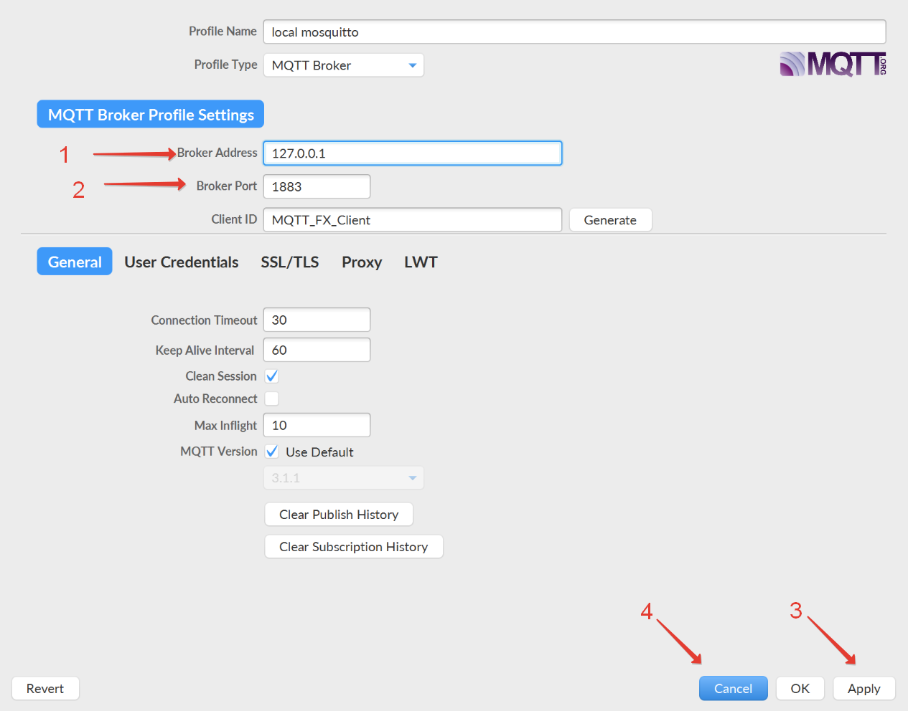
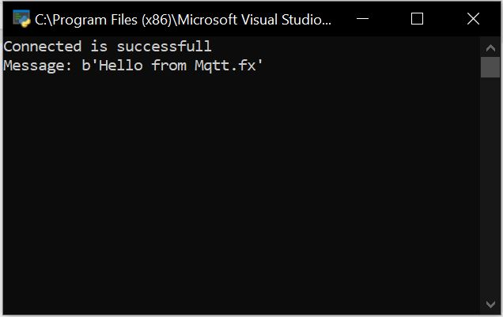

## Лабораторная работа 4.2. MQTT-клиент в Python
### Цель работы
Требуется научится работать с MQTT-сервером на языке Python

### Ход работы
Первым делом необходимо создать Python проект и установить библиотеку для работы с MQTT-сервером.
Для этого в консоли Python необходимо прписать следующее:
```
pip instal paho-mqtt
```
После установки библиотеки копируем код из примера работы 4.2.1:
```
import paho.mqtt.client as mqtt

# The callback for when the client receives a CONNACK response from the server.
def on_connect(client, userdata, flags, rc):
    print("Connected with result code "+str(rc))
    # Subscribing in on_connect() means that if we lose the connection and
    # reconnect then subscriptions will be renewed.
    client.subscribe("$SYS/#")

# The callback for when a PUBLISH message is received from the server.
def on_message(client, userdata, msg):
    print(msg.topic+" "+str(msg.payload))

client = mqtt.Client()
client.on_connect = on_connect
client.on_message = on_message
client.connect("iot.eclipse.org", 1883, 60)

# Blocking call that processes network traffic, dispatches callbacks and
# handles reconnecting.
# Other loop*() functions are available that give a threaded interface and a
# manual interface.

client.loop_forever()
```


Чтобы проверить работоспособность скрипта на Python создадим MQTT сервер в нашейй локальной сети с помощью программы Mqtt.FX
Для этого, в настройках сервера укажем ip-адрес нашей сети и порт, применим изменения и закроем окно:

Сервер запущен. Теперь изменим тестовый код под себя, добавим фунцию которая будет отправлять сообщения,
добавим комментарии.
Получим следующий код:

```
# подключаем библиотеку
import paho.mqtt.client as mqtt

# данная функция вызывается при удачном подключении к серверу
def on_connect(client, userdata, flags, rc):
    # уведомление о подключении
    print("Connected is successfull")
    # подписываемся на топик
    client.subscribe("iot_topic")

# данная функция вызывается при поступлении сообщений 
# в топик на который подписались
def on_message(client, userdata, msg):
    # вывод текста полученного сообщения
    print("Message: "+str(msg.payload) )

# Создаем подключение
client = mqtt.Client()
client.on_connect = on_connect
client.on_message = on_message
client.connect("127.0.0.1", 1883, 60)
# отправляем одно сообщение для теста 
# работаспособности функции отправки сообщений 
client.publish(topic="iot_topic", payload="hello from python", qos=0, retain=True)
# вызов функции бесконечного цикла для постоянной прослушки порта
client.loop_forever()

```
Теперь запускаем скрипт и заходи в MQTT.fx чтобы проверить наличие новых сообщений:

В наш топик поступило новое сообщение которое было отпралено из python-скрипта.
Теперь отправим сообщение в этот же топик только уже из Mqtt.fx и проверим как отреагирует на него скрипт.

Как мы можем видеть, сообщение пришло.
### Вывод
Таким образом в данной лабораторной работе я научился работать с Mqtt-сервером, а именно:
 *создавать топики  
 *отпралять сообщения в конкретные топики 
 *получать сообщения из конуретных топиков

