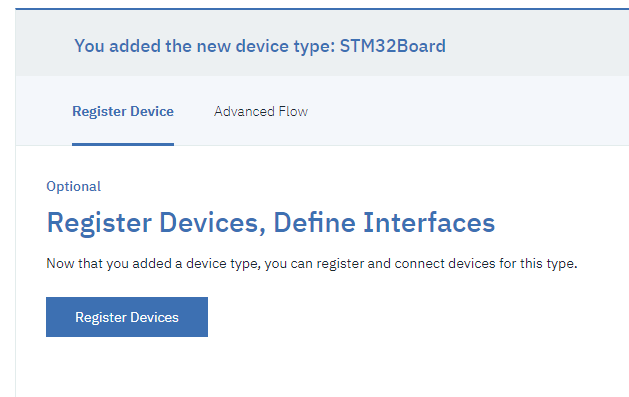
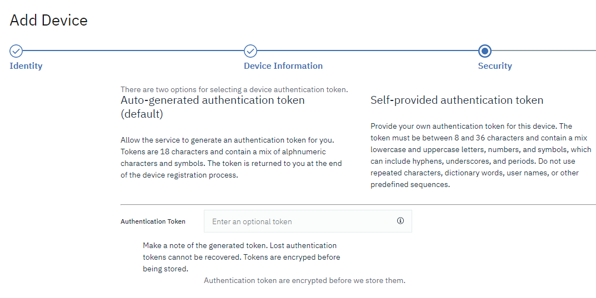
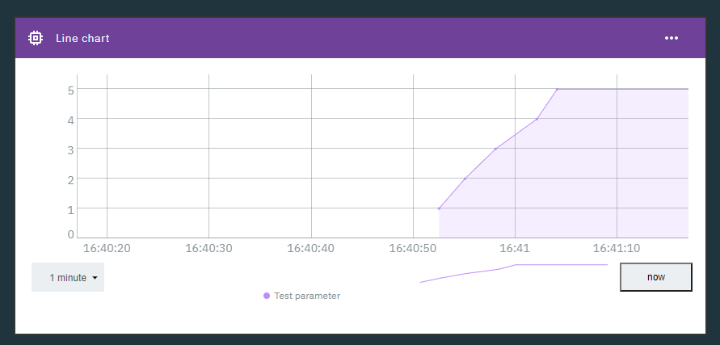

# 5.2 Лабораторная работа: Начинаем работу с Wi-Fi модулем
## Цель работы
Требуется создать и зарегистрировать виртуальное устройство, соединиться с собственным виртуальным устройством по MQTT.
## 5.2.1 Регистрация и создание устройства

Регистрация в IBM Cloud(https://www.ibm.com/ru-ru/cloud)

Затем переход по ссылке(https://cloud.ibm.com/catalog)

Нам необходм только пункт Internet of Things:

 


Нажать кнопку Create.(Кнопка Create позволяет подключать устройства Интернета вещей)

Важное условие при подклчении устройств
------
* не более 500 штук

* не более 200 Мб памяти на каждое

Нажать кнопку Launch!


Появится экран вашей панели управления устройствами Интернета вещей:


Адрес этой панели это фактическое название новосозданной организации в терминах IBM Cloud. Название организации выдается случаным образом, есть возможность задать свое имя. 

Далее необходимо создать новое устройство:

* Нажать Create a device

* Указать тип устройства

* Указать идентификатор устройства


Так как работа осуществляется с виртуальным устройством во вкладке Device Types пишем свой тип устройства, к примеру STM32Board. Далее в следующем окне указываем версию прошивки, производительность и прочее(можно не заполнять).


После успешного добавления устройства появляется возможность зарегистрировать новое устройство:

* нажать кнопку Regiter Devices



Результат:
 


Далее необходимо сгенерировать аутентификационный ключ:


Важно!
-------
* использовать автоматическую генерацию ключа
 

Важно!
-------
* Сохранть ключ (в данном примере XAGOijHh!*hp3+lRZD) в надежное место. 
* После закрытия сеанса браузера с этой страницей, вы больше никогда не увидите этого ключа.

## 5.2.2 Коммуникация с устройством - симуляция данных

На рисунке снизу изображена схема коммуникации между устройствами через протокол MQTT.
 
 
Используя графический клиент MQTT.fx, создаётся подключение к виртуальному устройству, предварительно зарегистрировав его. Тип устройства – STM32Board.

Ключ был сгенерирован автоматически.

 
 
Для проверки работоспособности отправляем сообщение от устройства. Для этого мы прописываем имя топика,идентификатор события и формат сообщения, который будет использоваться в формировании сообщения. Имя топика будет такое:
```C

iot-2/evt/my_event/fmt/json
```

А сообщение в формате JSON: {"key1": "5"}

Далее создаётся график с данными key от 1 до 5 в разделе Dashboard:
 

