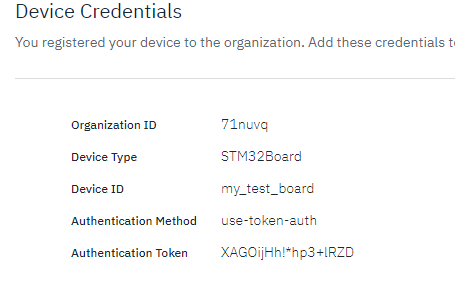

# 5.2 Лабораторная работа: Начинаем работу с Wi-Fi модулем
## Цель работы
Требуется создать и зарегистрировать виртуальное устройство, соединиться с собственным виртуальным устройством по MQTT.
## 5.2.1 Регистрация и создание устройства

Регистрация в IBM Cloud(https://www.ibm.com/ru-ru/cloud)

Затем переход по ссылке(https://cloud.ibm.com/catalog)

Нам необходм только пункт Internet of Things:

 

Нажать кнопку Create. Это позволит вам подключать устройства Интернета вещей

Важное условие при подклчении устройств
------
* не более 500 штук

* не более 200 Мб памяти на каждое

 

Нажать кнопку Launch!

 

Появится экран вашей панели управления устройствами Интернета вещей:

 

 

Адрес у этой панели будет наподобие http://71nuvq.internetofthings.ibmcloud.com, то есть такой немного странный URL со случайными буквами и цифрами. Фактически - это название вашей организации в терминах IBM Cloud. Поскольку вы не создавали никакой организации (такая возможность тоже есть), то у вас получилось случайное название. 

 

Мы сразу находимся на вкладке Devices, так что давайте сразу создадим какое-нибудь устройство. Нажмите Create a device. Однако, от вас сразу же потребуют указать тип устройства и его идентификатор:

 

У нас пока нет никаких типов устройств, поэтому идем во вкладку Device Types. Там придумайте какой-нибудь свой тип устройства, к примеру, STM32Board. В реальной жизни это идентификатор модели устройства. В следующем окне вам предложат ввести метаданные (версия прошивки, производитель и прочее) - здесь можно ничего не заполнять.

 

Итак, после того, как добавили тип, появляется возможность зарегистрировать новое устройство:

 

Получаться будет примерно так:

 

Поля с детальной информацией об устройстве пока можно опять пропустить. А вот дальше интересное: вам предложат сгенерировать аутентификационный ключ:

 

 

Рекомендуется ничего не сочинять и взять автоматически сгенерированный ключ. Получится примерно так:

 

Сохраните себе этот ключ (в данном примере XAGOijHh!*hp3+lRZD) в надежное место. Потом, после закрытия сеанса браузера с этой страницей, вы больше никогда не увидите этого ключа.

 

Теперь ваше устройство видно в общем списке устройств и вы можете смотреть последние события и статус.
