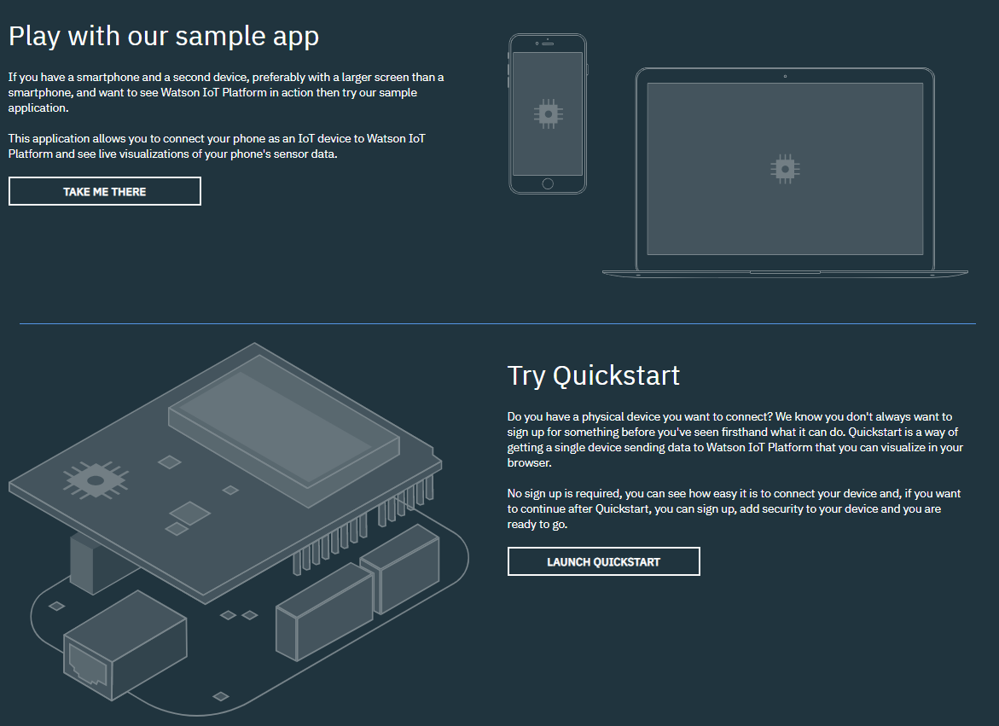

### Лабораторная работа 5.1 Быстрый старт с IBM Cloud

### Цель работы: Познакомиться с IBM Cloud и научиться подключать свои устройства
#### 5.1.1. Пример IBM Cloud Quickstart

Очень удобно, что у IBM Cloud есть готовый пример, для изучения которого даже не нужно создавать никакого аккаунта и не нужно иметь физических устройств. Он называет Quickstart и находится по адресу: https://internetofthings.ibmcloud.com/
Там предлагается посмотреть два варианта примера:

* С использованием своего устройства
* С использованием мобильного телефона



Поскольку для варианта “свое устройство” не нужно устанавливать никакого приложения на телефон, это быстрее, поэтому вначале посмотрим этот вариант, а уже потом с мобильным телефоном. 

#### Пример с симулированным устройством.

Нажмите Launch Quickstart. Появится окно:


В нем необходимо указать идентификатор вашего устройства. Мы пока не знаем его, так что будем симулировать устройство. Потом можно будет подключить и реальное устройство, мы это будем делать далее.

Чтобы поработать с симуляцией сенсора, перейдите по адресу: https://quickstart.internetofthings.ibmcloud.com/iotsensor
Если делать свайп влево-вправо, то увидите разные показания: температура в помещении, влажность, температура объекта. Эти параметры можно менять стрелочками. Обратите внимание, что вверху справа - как раз тот самый идентификатор устройства. На этом скриншоте он оказался eb5d4ba8406b, но если перезагрузите страничку, увидите, что идентификатор поменялся.


Теперь введите этот идентификатор на страничке Quickstart - и увидите, как показания меняются с течением времени на графике (если, конечно, вы поменяете их на экране сенсора).

Итак, из этого примера мы поняли, что у каждого устройства есть свой уникальный идентификатор (deviceID), и по нему мы можем обращаться к устройству.


#### 5.1.2. Пример со смартфоном

Теперь очень легко будет изучить пример для смартфона. Есть приложение IoT Starter для Android, его установочный файл можно скачать здесь:
https://github.com/deveops/iot-starter-for-android/releases


Там же лежат и исходники этой программы - может вам пригодится для ваших самостоятельных доработок.

В программе всё очень просто: вводите quickstart в поле “Организация”, MAC-адрес телефона в поле Device ID. Узнать MAC-адрес можно в настройках подключения WiFi. Введите его без двоеточий, как на скриншоте ниже.


После чего нажимаете Activate Sensor. И тот же самый идентификатор устройства (MAC-адрес без двоеточий) вводите на уже знакомой вам странице IBM Cloud Quickstart.


Данные с телефона в интерфейсе Quickstart будут следующие:


Как видите, достаточно много параметров, и каждый из них можно вывести на отдельном графике.

#### 5.1.3. Коммуникация через MQT
Теперь, конечно, сразу интересно, а можно ли отправлять какие-то свои данные туда, от своего устройства, а не симулированного. Ответ: да. Причем опять нам не нужно нигде регистрироваться и создавать аккаунт, всё взаимодействие по-прежнему будет осуществляться через уникальный deviceID.

 

IBM Cloud поддерживает коммуникацию через MQTT (предпочтительно) или через HTTP. Давайте попробуем сделать через MQTT, причем вначале не с платы, а просто с компьютера, используя стандартные команды наподобие mosquitto_pub. Будем симулировать устройство и смотреть, как данные приходят на сервер

В сервисе Quickstart есть ряд ограничений, связанных с тем, что это тестовый сервис:

* нет подтверждения получения сообщения

* не поддерживается QoS уровнем выше 0

* не требуется никакой аутентификации

* нет возможности передачи команд устройству (можно только получать и отображать сообщения от устройства), то есть коммуникация однонаправленна

* если сообщения посылаются чаще, чем раз в секунду, их могут отбрасывать

В остальном это очень удобный сервис в целях упражнения.

### Параметры подключения

Параметры подключения будут следующие:

* Адрес: quickstart.messaging.internetofthings.ibmcloud.com
* Порт: 1883
* Идентификатор клиента: d:quickstart:my_test:my_test_board


А параметры сообщения, которое отправляем, будут такие:

* Топик: iot-2/evt/my_event/fmt/json
* Текст сообщения: 10 (или любое другое число)
Здесь в общем всё понятно, кроме идентификатора клиента (clientID): он составлен из нескольких термов, из которых для нас пока существенен только последний: my_test_board (или любой другой идентификатор по вашему желанию) - это и есть тот самый deviceID, который мы вводили в окне просмотра графика.
Чтобы подключиться через графический клиент, наподобие MQTT.fx, укажите такие настройки:


Все остальные - по умолчанию. И отправка сообщения будет выглядеть так:


В MQTTLens всё аналогично: 


Что получится в результате: открыв график по адресу https://quickstart.internetofthings.ibmcloud.com/#/device/my_test_board/sensor/ (подмените my_test_board на идентификатор своего устройства), вы увидите точку с отправленным вами значением на графике:

Более того, вы увидите статус устройства (подключено/не подключено) и лог событий.

Вы можете заметить, что система вам говорит о неправильном формате сообщения. Это потому, что она ждет сообщения в формате { "d": {"ключ": "значение"} }.

Поэтому, если теперь вместо просто числа отправлять что-то наподобие { "d": {"temperature": "39"} }, то увидите гораздо более красивый график:


#### 5.1.4. Отправка данных с платы микроконтроллера

Теперь, когда мы всё отладили, очень легко послать свои данные с устройства. Всего-то нужно:

* Плата микроконтроллера
* Соединение платы с Интернетом

Из программных требований, нужно, чтобы для вашего устройства были библиотеки для подключения к Интернету и для работы с MQTT. То есть уже должны быть выполнены соответствующие лабораторные работы.

Вот демо-код для подключения к IBM Quickstart. Здесь отправляется сообщение c данными о температуре устройства с его названием. 


```Python
import json
import time
import paho.mqtt.client as mqtt

client = mqtt.Client('d:quickstart:my_test:hiber_device')

client.username_pw_set('use-token-auth', 'TOKEN')
client.connect('quickstart.messaging.internetofthings.ibmcloud.com', 1883, 60)


client.loop()
temp = 20
while (True):
    payload = {'temperature': temp}
    temp += 1
    client.publish('iot-2/evt/my_event/fmt/json', json.dumps(payload))
    print('published temperature {}'.format(temp))
    time.sleep(1)

client.disconnect()
```
Результат выполнения этого кода будет следующий:

![].(img/2.png)
Как видно, справа вверху появилась точка с данными.
Теперь вы знаете, как формировать сообщение и отправлять его. Как вы видите, пример вообще почти ничем не отличается от примера с MQTT, единственные тонкости - указать client_id и топик, и правильно сформировать тело сообщения.

